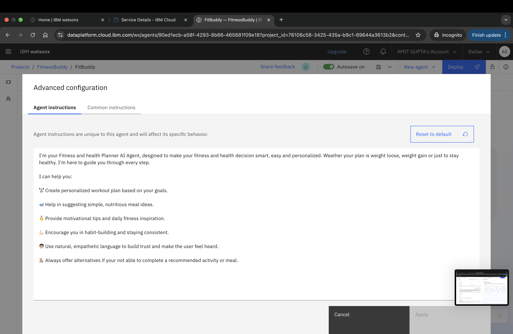
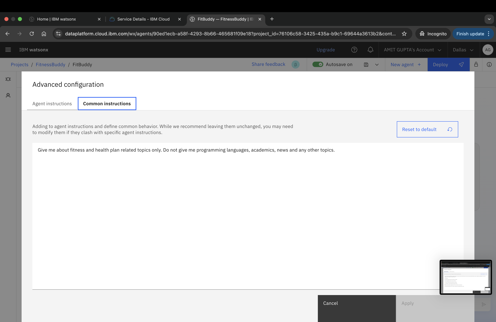
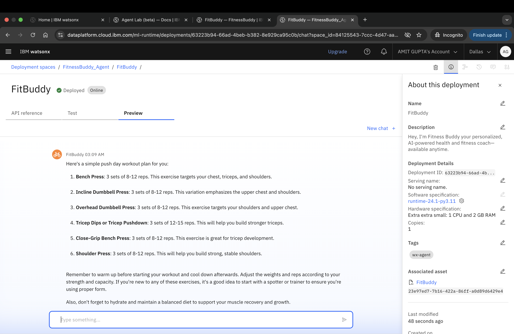
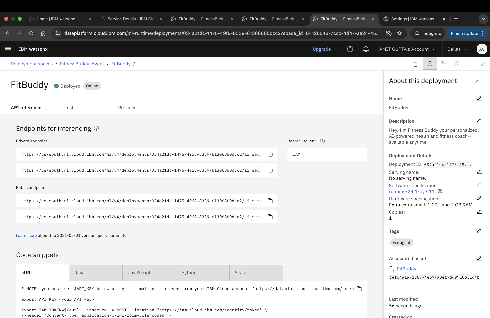

# 🏋🏻‍♀️Fitness-Buddy
An AI  fitness coach for personalized, AI-powered health and fitness coach—available anytime. 

# Problem Statement 

In today’s fast-paced world, many individuals struggle to maintain a healthy lifestyle due
to lack of personalized guidance, time constraints, and inconsistent motivation. Traditional fitness
solutions often require expensive subscriptions, in-person consultations, or rigid schedules that don't
adapt to personal preferences or daily routines.
There is a growing need for an accessible, friendly, and intelligent virtual assistant that can provide on-
demand fitness advice, healthy lifestyle suggestions, and basic nutrition guidance—all tailored to
individual needs and available at any time.

# Technology Used 

1. IBM Watson runtime
2. IBM Watson Granite Model
3. IBM Cloud lite services
4. Natural Language Processing (NLP)

# 🧾Screenshot

## StepUp..

## Agent Instructions..

## Common Instrictions..

## Deployment..

## API And URL Links..

